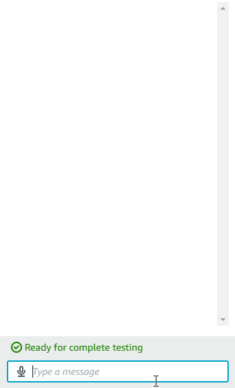
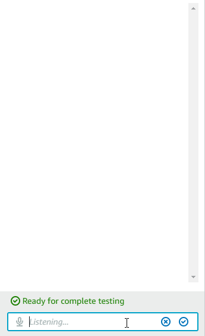
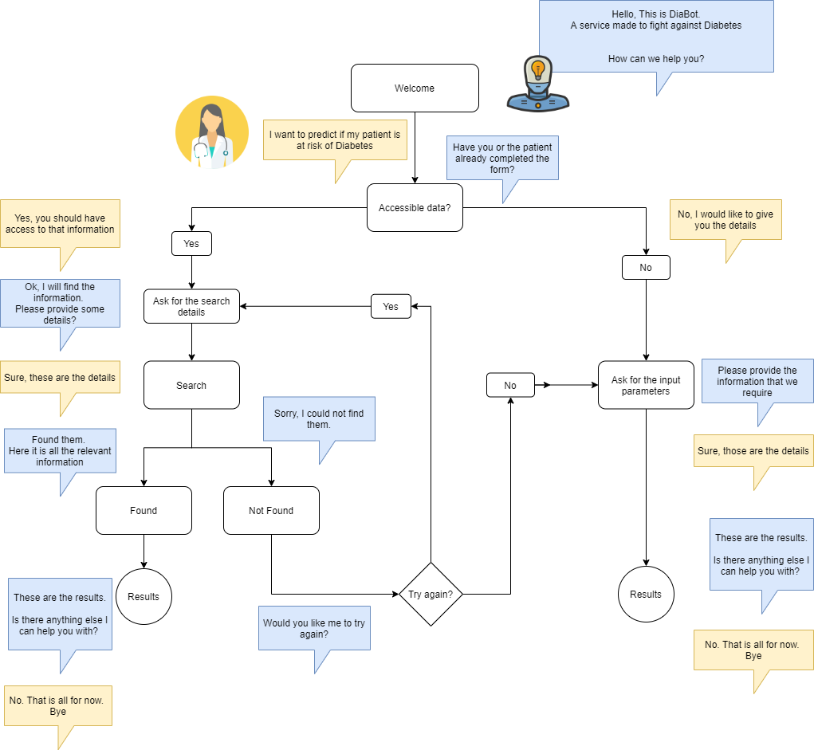
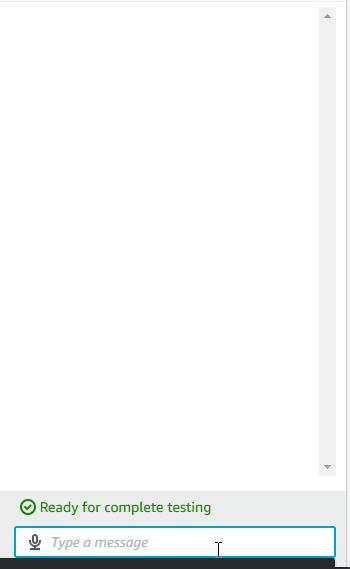

# Diabot

Type 2 diabetes occurs when the body resists the effects of insulin and cannot make enough insulin to maintain blood glucose levels within the target range. This leads to high blood glucose levels.Type 2 Diabetes affects almost 90% of all people with Diabetes. Our Diabetes predictor bot will advise you on your risk of acquiring diabetes and recommend a Diabetic clinic close to you to seek preventative treatment early. 

It is our aim to extend our bot from just a Diabetes risk predictor to become a holistic health bot taking in more disease data inputs. We can then extend our health bot's recommendation capabilities to aid practitioners in everyday practice and motivate their patients to take control of their own well-being.  

## Team members

- Julia 
- Dave
- Miguel

## Project Description

## What problem does the app attempt to solve?

An automated health advisor designed for people not for organisations. It can be used to predict the risk of acquiring disease using an individual's reported lifestyle inputs within Machine Learning (ML) Classification Algorithms. We can then use Natural Language Processing (NLP) of review sentiment to compare and recommend health related offerings like Clinical Services. Commercially, the bot may appeal to many corporations within the health sector from product suppliers to Private Health Insurance companies looking to promote their products and provide quotes off of the bot's predictions.

## How does the app solve this problem at a high-level?

- Robot Advisor to engage and interact with Patients/Users.
- Machine Learning Algorithms to predict the likelihood of an individual to develop specific diseases.
- NLP to interpret people's perception about products, services or establishments.
- Market Analysis to present the best recommendations to the users.

## What steps are taken to build the app?

1. Find studies about specific diseases that can be used to train ML Algorithms
2. Design and build a mechanism to capture the key features of the model
3. Design and build an AWS Lex Bot to interact with users
4. Integrate the bot with the ML model and the data collected
5. Develop Python functions to provide results to the users based on the different inputs
6. Define the parameters that are going to be used to suggest the best Health products to the users
7. Implement a NLP solution to interpret reviews from locations
8. Implement a health related product advisor

# Bot Installation

## Pre-requisites

### Lex Bot V2

[Bot Export](LexBot/DiaBot-Export-JSON.zip)

### Code for the AWS Lambda Function

[Bot Intent Handler](LexBot/lambda_function.py)

[Integration with JotForms](LexBot/integration.py)

[Prediction Model](LexBot/prediction_model.py)

The lamda function must support Pandas and Request. If you want to import the dependancies as existing layers you may want to have a look at [this link](https://github.com/model-zoo/scikit-learn-lambda)

Alternatively, They need to be installed along with the code.

# Testing Examples

## Public

### High Risk

### Low Risk

i

## Private (Integration Module)

The bot must follow a similar pattern as the one shown below:

### Pracitioners - Request Data (Integration)

## For future use cases

- Implement an API that is capable of interacting with many different ML. It is not suggested to have the ML models as part of this repo.

## Presentation

[PDF Version](Diabot_slides.pdf)
